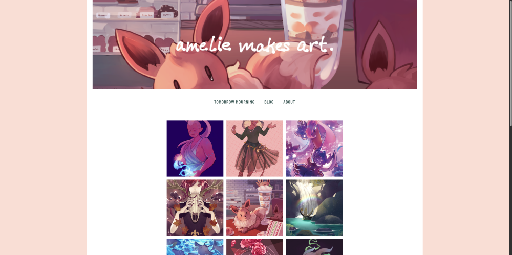

i felt like i shouldn't leave my poor li'l blog alone for too long so i figured i'd post what i've been doing with the site and how i'm getting along with [hugo](https://gohugo.io "hugo's homepage"), a static site generator. 

## overall look and feel

oreiginally i was using an example hugo skeleton theme to build off of but eventually i ended up with enough original content™ to basically call this my own theme! i named it *cozy* after the clip studio paint brushes i made, also named *cozy*. maybe someday *cozy* will because streamlined, refined, and cool enough to be released as a theme on its own in the wild. kinda doubt it. at least with *cozy's* inception (more like a soft launch?) i finally added a css query for `prefers-color-scheme: dark` so now the site's look will change depending on you've set your theme preference in your browser to dark or light. 

the dark mode is actually based on a color palette i use for my terminal and window manager theme[^1]. the light mode is just because i love a dusty pastel pink. i got rid of the tiling background image because honestly, i wasn't too in love with it.

i reduced the font sizes of the site overall, leaving the h1 headings alone for the most part. the larger fonts weren't that much more readable to me due to my own visual disabilities. they also made the site look clunkier and more awkward as a whole. i think with a different set of fonts, bigger type could have done the trick—other sites have done this beautifully—but i just could not finagle a good look with the current body typeface[^2] that i really wanted to keep. 

the header touches the top of the page and there is now a link to this blog. i removed the horizontal lines surrounding the site navigation because i didn't really have any ideas on how to take them further design-wise; they were just getting in the way. i really wanted to work with them though. too bad!

## blog-related changes 

i've rambled on emough so i'm just gonna hit on some bullet points for the changed i made to the blog proper or else i'd never stop writing tbh
- blog posts now show tags at the bottom 
- bottom also displays categories so i can put all related adventures in one spot  
- table of contents moved to side if you're on desktop
  - well, i think it looks cool at least. either way it's a lot better than havng it inline with text wrapping around it, i guess
- edited main nav to have link to blog
  - yeah i said that already but it's exciting
- typography changes
  - overall focus on making reading easier
  - smaller font for blog posts
  - better looking headings
  - made blog text area more narrow and thus easier to read, esp if you sit closer to your monitor

and finally, i added a specific hugo shortcode for html `aside` elements. if you enable unsafe markup in your `hugo.toml` you can use regular html tags in your blog posts/markdown documents. you can add a callout/aside this way but you won't be able to use markdown inside of it, like this: 

`<aside>this is an aside **with bold text**</aside>`

it looks like this when rendered: 
<aside>this is an aside **with bold text** </aside>

the shortcode is a bit ~~Long-winded~~ annoying compared to just using html tags but it allows for something like this:

`this is an aside **with bold text**`

this is an aside **with bold text**

i might edit that shortcode to add something like a class or a title so i have can different flavors of callouts (like warning! or note: or idea). sounds kinda cute.

## hugo thoughts 
so! speaking of hugo, i've been using it for about a year and a half, sort of? git says i made this site's inital commit in december 2022. when i first started i had no idea what was going on. my knowledge was so lacking that even the documentation was about as opaque as a brick wall to me. in the beginning, couldn't even begin to wrap my head around the templating language docs (tbh i still kinda can't but now at least i think it's a lack of Go knowledge)

things that changed in 2023: i took and finished Harvard's CS50x class. wow i kinda know what a templating language is made of now instead of just seeing random words inside curly brackets. i guess it follows that i *kind of* know how to use one if i see it. shoutouts to [Flask lessons](https://flask.palletsprojects.com/en/3.0.x/tutorial/templates/ "flash templating documentation").

but even still... it took me several months to understand what any of [this lookup order](https://gohugo.io/templates/lookup-order/ "hugo template lookup order documentation") meant in the context of themes and how to name pages so they wouldn't either be mangled or not found. and i had to read several different things before i even began to understand what bundles were (it seems obvious in hindsight but it was just so bogged down with mentions of accessing resources, getting Pages, Kinds, and 80 pieces of [jargon](https://gohugo.io/getting-started/glossary/ "hugo glossary")...). i'm certain there are still things i could improve on because of something that hasn't clicked; one thing that i just thought of is having an `_index.md` file as the root of my blog content. i think if i set things up correctly, i wouldn't need that.

hm.

\*typing noises*

ok i just checked and i guess i didn't need it but also some months ago when i tried this same thing, i got a 404 not found error so uhhh idek :woozy_face:

anyway, using hugo would probably be a lot less headache if i wasn't Like This and desperately needed to make a theme of my own *and* mold it around my needs. if you just want to have a blog, hugo is extremely simple to set up. you just install the hugo binary, make a folder, `cd` into the folder and initalize the site with one command. then you can either pick a pre-made theme or use hugo's skeleton theme and that's it. all you need to do is create text files in a folder named `content`.

but yeah unfortunately i am built different. ~~i'm worse~~[^3]. 

## li'l ideas
there are still a bunch of loose ends to tie up before i think i'll feel satisfied with the state of ameliemakes.art and the ameliemakes.art blog. i even found a bunch while writing this post! there are just a lot of "edge cases" i'll need to find and take care of. really, they're not edge cases—they're just things that *i* never use like tables and uh blockquotes with attribution and sourcing. i also am working on my portfolio proper (wow i really AM making art) and looking for ways to lessen my reliance on javascript on the website side. i don't have any real beef with js but i thought seeing what i could achieve with only css could be fun.

[^1]: alacritty and i3wm btw
[^2]: [atkinson hyperlegible](https://brailleinstitute.org/freefont "braill institute")
[^3]: i saw this as an uncredited twitter screenshot PLEASE if anyone find it let me know i have this phrase stuck in my head
